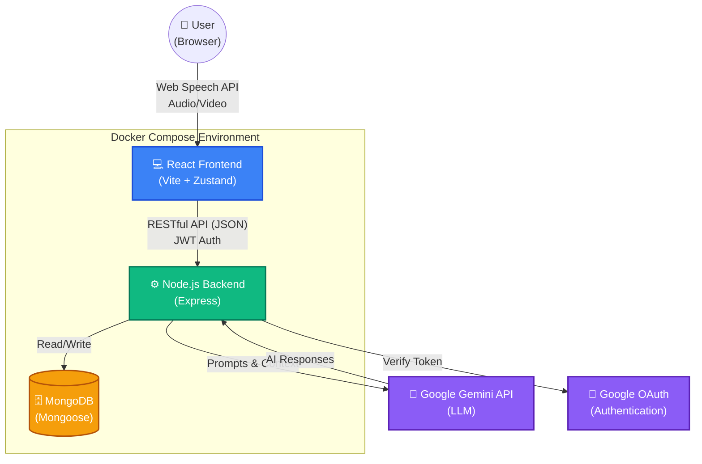

# GenAI Interview Preparation Platform 🚀

A modern, full-stack MERN application designed to help candidates prepare for technical and behavioral interviews. The platform leverages the Google Gemini API and Web Speech API to provide real-time voice and video mock interviews, complete with detailed ATS resume parsing and actionable feedback scorecards.

---

## 🏗 System Architecture

The platform follows a containerized, decoupled architecture for scalability and ease of deployment.



---

## ✨ Key Features

- **Live Video Interviews**: Practice with an AI hiring manager that asks follow-up questions using the Web Speech API for real-time transcription and voice synthesis.
- **ATS Resume Parsing**: Upload a resume (PDF) and paste a job description. The AI extracts skills, matches qualifications, and generates a personalized interview plan.
- **AI Feedback & Scoring**: Every interview generates a detailed scorecard, filler-word analysis, and actionable feedback for improvement.
- **Robust Security**: Rate Limiting (anti-DDoS), JWT HttpOnly cookies, and bcrypt password hashing.
- **Automated Testing**: 100% integration test passing rate using **Jest**, **Vitest**, and React Testing Library.

---

## 🛠 Tech Stack

- **Frontend**: React (Vite), React Router, SCSS, React Hot Toast, Zustand
- **Backend**: Node.js, Express, MongoDB, Mongoose
- **AI Integration**: `@google/genai` (Gemini API)
- **Authentication**: Passport.js, JWT, bcryptjs
- **DevOps**: Docker, Docker Compose
- **Testing**: Jest, Supertest, Vitest

---

## 🐳 Quick Start (Docker)

The absolute easiest way to run the entire stack (Frontend, Backend, and MongoDB) is using Docker Compose.

### 1. Prerequisites
- [Docker & Docker Desktop](https://docs.docker.com/get-docker/) installed and running.
- A Google Gemini API Key.

### 2. Environment Setup
Create `.env` files in both the `Frontend` and `Backend` directories. You can copy the provided templates:
```bash
cp Backend/.env.example Backend/.env
cp Frontend/.env.example Frontend/.env
```
*(Make sure to add your Gemini API Key inside `Backend/.env`)*

### 3. Run the Stack
From the root of the project, run:
```bash
docker-compose up -d --build
```

The platform is now live!
- **Frontend UI**: [http://localhost:5173](http://localhost:5173)
- **Backend API**: [http://localhost:5050](http://localhost:5050)

To stop the containers, run:
```bash
docker-compose down
```

---

## 🚦 Manual Installation (Without Docker)

If you prefer to run the Node servers manually:

1. **Start the Backend**:
   ```bash
   cd Backend
   npm install
   npm run dev
   ```

2. **Start the Frontend**:
   ```bash
   cd Frontend
   npm install
   npm run dev
   ```

*(Ensure you have a local MongoDB instance running on port `27017` or provide an Atlas URI in your `.env`)*

---

## 🧪 Testing

This project is fully covered by automated integration and unit tests.

**To run Backend Tests (Jest):**
```bash
cd Backend
npm test
```

**To run Frontend Tests (Vitest):**
```bash
cd Frontend
npm test
```

---

## 🤝 Contributing
Contributions, issues, and feature requests are welcome! Feel free to check the issues page.
