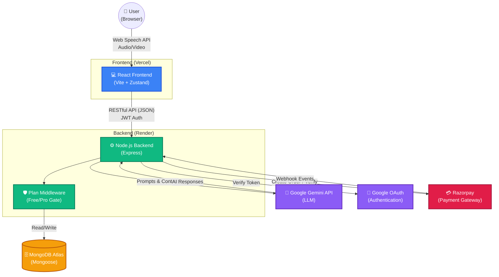
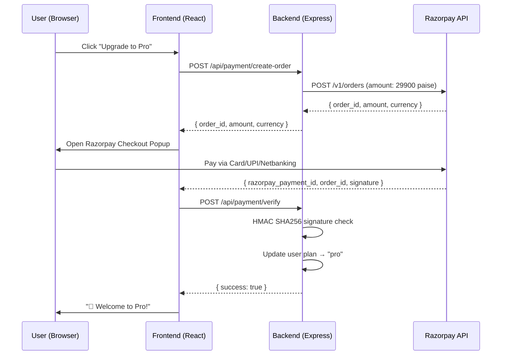

# Hirelens — AI Interview Preparation Platform 🚀

A modern, full-stack MERN application designed to help candidates prepare for technical and behavioral interviews. The platform leverages the **Google Gemini API** and **Web Speech API** to provide real-time voice and video mock interviews, complete with detailed ATS resume parsing, actionable feedback scorecards, and a **Razorpay-powered freemium monetization system**.

> **Live Demo**: [hirelens.vercel.app](https://gen-ai-project-with-mern.vercel.app) · **Backend API**: Hosted on Render

---

## 🏗 System Architecture



---

## ✨ Key Features

### 🎯 Core Interview Features
- **AI Interview Report Generation** — Upload a resume (PDF) + paste a job description → get a personalized interview strategy, question bank, and ATS compatibility score.
- **Live Voice Call Interview** — Practice with an AI interviewer in real-time using the Web Speech API for transcription and voice synthesis.
- **Video Interview with AI Feedback** — Full video mock interviews with facial expression analysis and detailed scoring.
- **Answer Evaluation** — Per-question evaluation with model answers, scoring, and improvement tips.
- **Email Delivery** — Interview reports and transcripts are automatically emailed to the user.

### 💳 Freemium Monetization (Razorpay)
- **Free Tier** — 3 interview reports per 30-day rolling window. ATS resume scoring included.
- **Pro Tier (₹299/month)** — Unlimited reports, Live Voice Interview, Video Interview, priority AI responses.
- **Razorpay Standard Checkout** — Secure payment via Cards, UPI, Netbanking, and Wallets.
- **3D Upgrade Modal** — When free users hit their limit, a stunning 3D glassmorphism modal with mouse-tracking tilt, floating orbs, and shimmer animations prompts them to upgrade.
- **30-Day Rolling Trial Window** — Free limits reset 30 days from the user's first report (not calendar month), with the exact reset date shown to users.
- **Webhook Verification** — Razorpay webhook with HMAC SHA256 signature verification for tamper-proof payment confirmation.

### 🔒 Security
- **Rate Limiting** — Anti-DDoS protection on all API routes.
- **JWT HttpOnly Cookies** — Secure, XSS-resistant authentication tokens.
- **bcrypt Password Hashing** — Industry-standard password security.
- **Plan Enforcement Middleware** — Server-side gatekeeping ensures free users can't bypass limits.

### 🧪 Testing
- Automated integration and unit tests using **Jest**, **Vitest**, and **React Testing Library**.

---

## 🛠 Tech Stack

| Layer | Technologies |
|---|---|
| **Frontend** | React 19, Vite, React Router v7, Zustand, SCSS, React Hot Toast |
| **Backend** | Node.js, Express, MongoDB, Mongoose |
| **AI** | Google Gemini API (`@google/genai`) |
| **Payments** | Razorpay Standard Checkout, Webhooks |
| **Auth** | Passport.js, Google OAuth 2.0, JWT, bcryptjs |
| **DevOps** | Docker, Docker Compose, Vercel (FE), Render (BE) |
| **Testing** | Jest, Supertest, Vitest |

---

## 📁 Project Structure

```
├── Backend/
│   ├── src/
│   │   ├── controllers/
│   │   │   ├── interview.controller.js    # Report generation, evaluation, chat
│   │   │   └── payment.controller.js      # Create order, verify, status, webhook
│   │   ├── middlewares/
│   │   │   ├── auth.middleware.js          # JWT verification
│   │   │   ├── plan.middleware.js          # checkFreeLimit, requirePro
│   │   │   └── rateLimiter.middleware.js   # Anti-DDoS
│   │   ├── models/
│   │   │   └── user.model.js              # User schema (plan, usage tracking)
│   │   ├── routes/
│   │   │   ├── interview.routes.js        # /api/interview/*
│   │   │   └── payment.routes.js          # /api/payment/*
│   │   ├── services/
│   │   │   └── razorpay.service.js        # Razorpay SDK integration
│   │   └── app.js                         # Express app setup
│   ├── .env.example
│   └── package.json
│
├── Frontend/
│   ├── src/
│   │   ├── features/
│   │   │   ├── auth/                      # Login, Register, OAuth, Protected routes
│   │   │   ├── interview/                 # Home, Interview, VideoInterview, Voice
│   │   │   └── payment/                   # Pricing page, UpgradeModal, services
│   │   │       ├── components/
│   │   │       │   └── UpgradeModal.jsx   # 3D glassmorphism upgrade prompt
│   │   │       ├── pages/
│   │   │       │   └── Pricing.jsx        # Free vs Pro comparison + checkout
│   │   │       ├── services/
│   │   │       │   └── payment.service.js # API calls (create-order, verify)
│   │   │       └── style/
│   │   │           ├── pricing.scss       # Pricing page styles
│   │   │           └── upgradeModal.scss  # 3D modal animations
│   │   └── app.routes.jsx                 # All routes including /pricing
│   ├── index.html                         # Razorpay checkout.js script
│   ├── .env.example
│   └── package.json
│
├── docker-compose.yml
└── README.md
```

---

## 🚀 Quick Start

### Prerequisites
- [Node.js](https://nodejs.org/) v18+ (or [Docker](https://docs.docker.com/get-docker/))
- A [Google Gemini API Key](https://aistudio.google.com/apikey)
- A [Razorpay Account](https://dashboard.razorpay.com) (for payment features)
- MongoDB Atlas URI (or local MongoDB)

### 1. Clone & Setup Environment

```bash
git clone https://github.com/Naveen34822/GenAi-Project-with-MERN.git
cd GenAi-Project-with-MERN

# Copy environment templates
cp Backend/.env.example Backend/.env
cp Frontend/.env.example Frontend/.env
```

Edit `Backend/.env` and fill in your credentials:
```env
MONGO_URI=your_mongodb_atlas_uri
JWT_SECRET=your_jwt_secret
GOOGLE_GENAI_API_KEY=your_gemini_api_key
PORT=5050

# Razorpay
RAZORPAY_KEY_ID=rzp_test_your_key_id
RAZORPAY_KEY_SECRET=your_key_secret
RAZORPAY_WEBHOOK_SECRET=your_webhook_secret

# Google OAuth (optional)
GOOGLE_CLIENT_ID=your_client_id
GOOGLE_CLIENT_SECRET=your_client_secret
FRONTEND_URL=http://localhost:5173
```

Edit `Frontend/.env`:
```env
VITE_RAZORPAY_KEY_ID=rzp_test_your_key_id
```

### 2a. Run with Docker (Recommended)

```bash
docker-compose up -d --build
```
- **Frontend**: http://localhost:5173
- **Backend**: http://localhost:5050

### 2b. Run Manually

```bash
# Terminal 1 — Backend
cd Backend && npm install && npm run dev

# Terminal 2 — Frontend
cd Frontend && npm install && npm run dev
```

---

## 💳 Razorpay Payment Flow



### Testing Payments (Test Mode)

| Method | Details |
|---|---|
| **UPI** | UPI ID: `success@razorpay` |
| **Card** | `5267 3181 8797 5449`, Expiry: `12/26`, CVV: `123`, OTP: `1234` |
| **Netbanking** | Select any bank → Click "Success" on fake bank page |

---

## 🧪 Testing

```bash
# Backend tests (Jest)
cd Backend && npm test

# Frontend tests (Vitest)
cd Frontend && npm test
```

---

## 🌐 Deployment

| Service | Platform | Notes |
|---|---|---|
| **Frontend** | Vercel | Add `VITE_RAZORPAY_KEY_ID` in Environment Variables → Redeploy |
| **Backend** | Render | Add `RAZORPAY_KEY_ID`, `RAZORPAY_KEY_SECRET`, `RAZORPAY_WEBHOOK_SECRET` in Environment |
| **Database** | MongoDB Atlas | Free M0 cluster works perfectly |

> **Important**: Vite bakes `VITE_*` env vars at **build time**. After adding/changing them on Vercel, you must trigger a **redeploy** for changes to take effect.

---

## 🤝 Contributing

Contributions, issues, and feature requests are welcome! Feel free to check the [issues page](https://github.com/Naveen34822/GenAi-Project-with-MERN/issues).

---

## 📄 License

This project is open source and available under the [MIT License](LICENSE).
